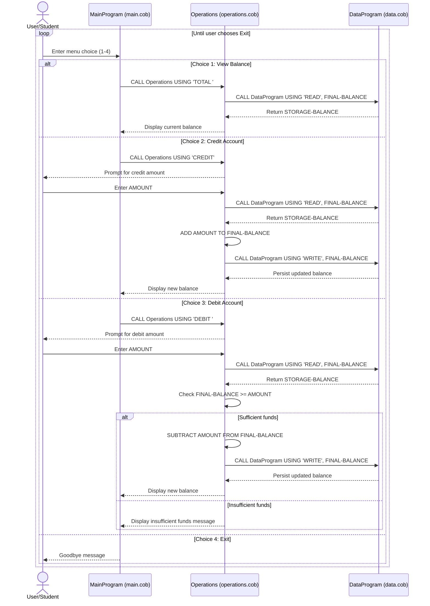
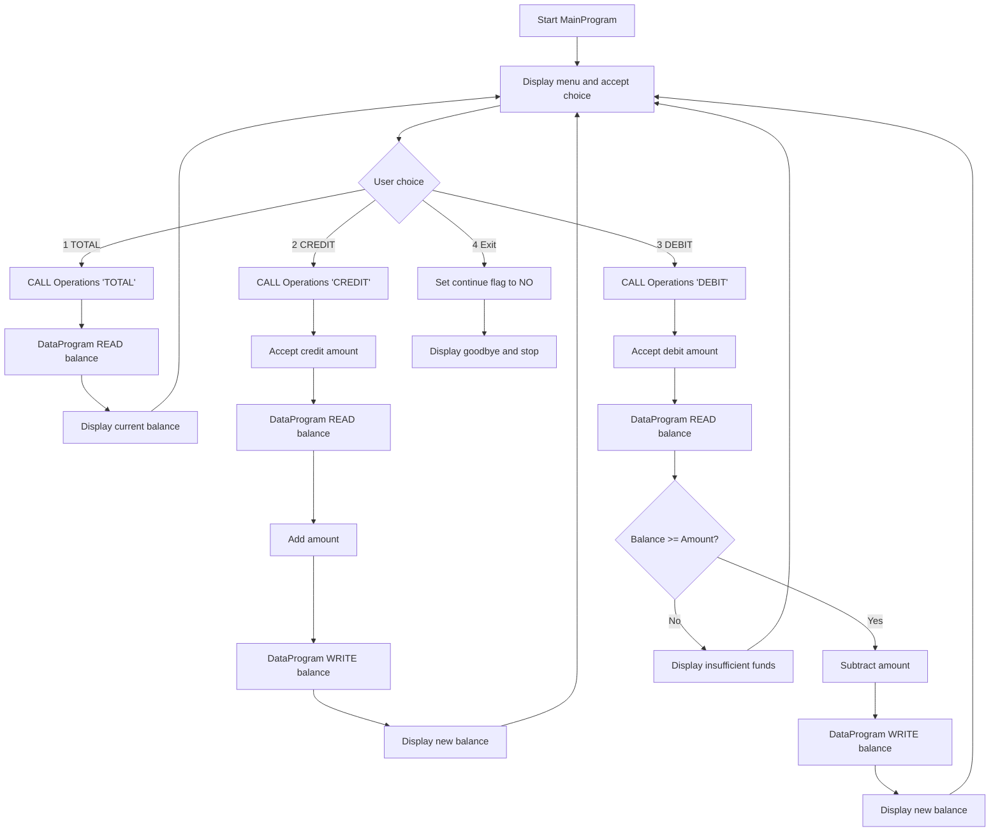

# COBOL Student Account System Documentation

## Overview

This COBOL application is a simple student account management system that supports:

- Viewing the current account balance
- Crediting (adding funds to) the account
- Debiting (subtracting funds from) the account with an insufficient-funds check

The system is organized into three programs under `src/cobol`:

- `main.cob` (menu and user interaction)
- `operations.cob` (business transaction processing)
- `data.cob` (in-memory data access layer)

## File-by-File Purpose

### `src/cobol/main.cob` — MainProgram

**Purpose:**

- Acts as the application entry point and interactive menu loop.
- Captures user choices and routes requests to the operations module.

**Key logic:**

- Displays a menu with four options:
  1. View Balance
  2. Credit Account
  3. Debit Account
  4. Exit
- Uses `EVALUATE USER-CHOICE` to dispatch calls:
  - `CALL 'Operations' USING 'TOTAL '`
  - `CALL 'Operations' USING 'CREDIT'`
  - `CALL 'Operations' USING 'DEBIT '`
- Repeats until option 4 sets `CONTINUE-FLAG` to `NO`.
- Handles invalid input by displaying an error message.

### `src/cobol/operations.cob` — Operations

**Purpose:**

- Implements account transaction behavior (balance inquiry, credit, debit).
- Applies core business rules around balance updates.

**Key logic/functions by operation type:**

- `TOTAL `:
  - Reads current balance from `DataProgram` using `READ`.
  - Displays the current balance.
- `CREDIT`:
  - Prompts for credit amount.
  - Reads current balance from `DataProgram`.
  - Adds amount to balance.
  - Persists updated balance via `DataProgram` using `WRITE`.
  - Displays new balance.
- `DEBIT `:
  - Prompts for debit amount.
  - Reads current balance from `DataProgram`.
  - Checks if `FINAL-BALANCE >= AMOUNT`.
  - If true, subtracts amount, writes updated balance, and displays new balance.
  - If false, displays an insufficient-funds message and does not update balance.

### `src/cobol/data.cob` — DataProgram

**Purpose:**

- Centralizes balance storage and data access operations.
- Provides a simple `READ`/`WRITE` interface to the shared balance.

**Key logic/functions:**

- Maintains `STORAGE-BALANCE` in working storage (initialized to `1000.00`).
- Accepts operation and balance via linkage:
  - `READ` → moves `STORAGE-BALANCE` to caller balance field.
  - `WRITE` → moves caller balance field into `STORAGE-BALANCE`.

## Key Business Rules for Student Accounts

1. **Single account balance model**
   - The current implementation manages one shared student account balance in memory (`STORAGE-BALANCE`).

2. **Initial balance**
   - Balance starts at `1000.00` at program initialization.

3. **View balance is read-only**
   - `TOTAL ` only reads and displays; it does not modify data.

4. **Credits always increase balance**
   - `CREDIT` adds the entered amount to the current balance and persists it.

5. **Debits cannot overdraw account**
   - `DEBIT ` is allowed only when current balance is greater than or equal to the requested amount.
   - If funds are insufficient, no write occurs and balance remains unchanged.

6. **Persistence scope is runtime memory**
   - Data is stored in `DataProgram` working storage, so persistence is in-process only (not a file/database).

## Call Flow Summary

1. `MainProgram` receives menu choice.
2. `MainProgram` calls `Operations` with operation code.
3. `Operations` calls `DataProgram` to `READ` and/or `WRITE` balance.
4. `Operations` returns to `MainProgram`.
5. Loop continues until user exits.

## Sequence Diagram (Data Flow)



## How to Render Mermaid

- **GitHub:** Open [docs/README.md](docs/README.md) in the repository on GitHub; Mermaid diagrams in fenced ` ```mermaid ` blocks render automatically.
- **VS Code:** Open [docs/README.md](docs/README.md) and use Markdown preview (`Ctrl+Shift+V` or `Cmd+Shift+V`).
- **If diagrams do not appear in VS Code:** Ensure Markdown preview is enabled and updated, or use a Mermaid-compatible Markdown extension.

## Compact Flowchart


